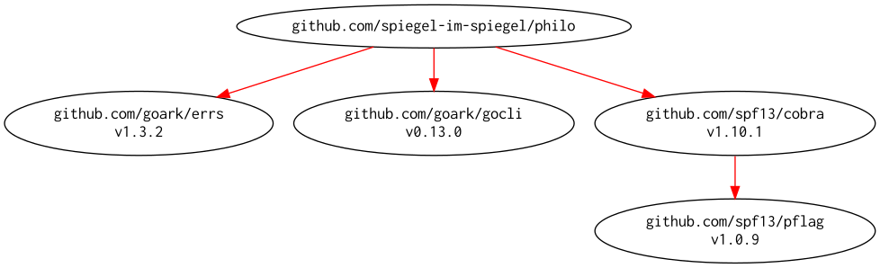

# [Philosophers] -- I never thought philosophy would be so deadly

[](https://github.com/spiegel-im-spiegel/philo/actions)
[](https://github.com/spiegel-im-spiegel/philo/actions)
[](https://raw.githubusercontent.com/spiegel-im-spiegel/philo/master/LICENSE)
[](https://github.com/goark/mt/releases/latest)

## Build and Install

```
$ go install github.com/spiegel-im-spiegel/philo@latest
```

## Binaries

See [latest release](https://github.com/spiegel-im-spiegel/philo/releases/latest).

## Usage

```
$ philo -h
Simulation for philosophers' problem.

Usage:
  philo [flags]
  philo [command]

Available Commands:
  help        Help about any command
  version     print the version number

Flags:
      --debug              for debug
  -h, --help               help for philo
  -m, --must-eat int       number of times each philosopher must eat (default 3)
  -p, --philosophers int   number of philosophers (default 5)
  -d, --to-die int         time to die (ms) (default 200)
  -e, --to-eat int         time to eat (ms) (default 20)
  -s, --to-sleep int       time to sleep (ms) (default 80)
  -t, --to-think int       time to think (ms) (default 80)

Use "philo [command] --help" for more information about a command.
```

## Modules Requirement Graph

[](./dependency.png)

[Philosophers]: https://github.com/spiegel-im-spiegel/philo "spiegel-im-spiegel/philo: Philosophers - I never thought philosophy would be so deadly"
